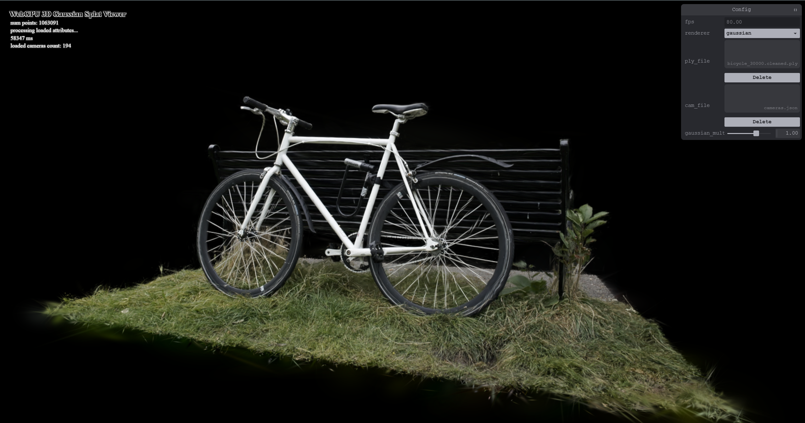

# Project5-WebGPU-Gaussian-Splat-Viewer

**University of Pennsylvania, CIS 565: GPU Programming and Architecture, Project 5**

- Jacqueline Guan
  - [LinkedIn](https://www.linkedin.com/in/jackie-guan/)
  - [Personal website](https://jyguan18.github.io/)
- Tested on my personal laptop:
  - Windows 11 Pro 26100.4946
  - Processor AMD Ryzen 9 7945HX with Radeon Graphics
  - 32 GB RAM
  - Nvidia GeForce RTX 4080

### Demo Video/GIF

[]

### Live Demo

The live demo for this project can be found [here](https://jyguan18.github.io/Project5-WebGPU-Gaussian-Splat-Viewer/).

## Introduction

For this project, I implemented a real-time Gaussian Splatting viewer using WebGPU. Gaussian Splatting is a novel rendering technique that represents 3D scenes as collections of 3D Gaussian primitives, which are projected and rendered as 2D splats. The renderer processes and displays 3D point clouds by converting each 3D Gaussian into a 2D splat through a series of transformations, including view-frustum culling, covariance projection, and depth-based sorting for correct alpha blending.

## Implementation

### Point Clouds

I implemented a basic point cloud renderer for comparison, which renders each Gaussian as a simple point primitive without computing covariance or performing alpha blending.

### Gaussian Render

#### Preprocessing Stage

In the Preprocessing Stage, each Gaussian undergoes the following transformations:

- View-Frustum Culling: Gaussians are transformed from world space to view space to normalized device coordinates (NDC). Any Gaussian outside the viewing frustum (with a 1.2x tolerance) or behind the camera is culled.
- Covariance Projection: For visible Gaussians, I compute the 3D covariance matrix from the rotation (quaternion) and scale parameters, then project it to 2D screen space using the Jacobian of the perspective projection. This determines each splat's size and orientation on screen.
- Spherical Harmonics Evaluation: Colors are computed by evaluating spherical harmonic coefficients based on the viewing direction, enabling view-dependent appearance effects.
- Atomic Compaction: Instead of storing splats at their original Gaussian indices, I use atomicAdd to assign consecutive indices only to visible splats. This eliminates gaps in the output arrays caused by culled Gaussians, ensuring efficient memory usage and preventing rendering artifacts.
- Depth Sorting Setup: Each visible splat's depth is stored (as 100.0 - viewPos.z bitcast to uint32 for radix sorting), along with its compact index for proper rendering order.

#### Indirect Drawing

Instead of passing parameters directly from the CPU to the GPU, we can store those parameters in a GPU using an indirect buffer. In this case, the GPU can modify how many things to draw without the CPU knowing ahead of time.

In this project, my compute shader decides which gaussians are visible (or culled) and how many splats actually need to be drawn. The shader will write the new number of visible splats into a counter and that count will be copied into the indirect draw buffer. So instead of drawing all of the point, we only draw the visible ones dynamically on the GPU.

This makes the renderer fully GPU-driven.

#### Rendering Stage

The vertex shader reconstructs 2D screen-space quads for each sorted splat, and the fragment shader evaluates the Gaussian function to determine pixel coverage and opacity, achieving smooth alpha-blended rendering through proper depth-sorted compositing.

## Performance Analysis

With both the bicycle and the bonsai splat scenes, the average frame rate remained pretty much the same regardless of the settings when running it on my machine. And so I'm focusing more on the theoretical performance implications rather than with data.

### Compare your results from point-cloud and gaussian renderer, what are the differences?

The point cloud only renders discrete points with visible gaps between them, which creates a bit of a sparse appearance and an outline of the shape. It is also only one color. The Gaussian renderer produces smooth, continuous surfaces by blending overlapping splats. The alpha-blended Gaussians fill gaps naturally, creating photorealistic results that closely match the original captured scene.

The point cloud renderer is simpler to render but it requires but it requires more points to achieve decent coverage. The Gaussian renderer achieves a better performance-to-quality ratio, even despite the additional preprocessing. The Gaussian approach should represent the scene more efficiently as each Gaussian can cover multiple pixels smoothly, whereas the point clouds would need many more primitives to achieve a similar (but still inferior) coverage.

### For gaussian renderer, how does changing the workgroup-size affect performance? Why do you think this is?

Workgroup sizes has a measurable impact on GPU performance due to how modern GPUs schedule and execute compute work.

Smaller workgroups would likely show lower occupancy and more overhead from launching many workgroups. Large workgroups would probably show diminishing returns or worse performance due to register pressure or cache contention.

GPUs schedule workgroups onto streaming multiprocessors (SMs). Larger workgroups should improve occupancy by keeping more threads active but only up to a point. Larger workgroups also consume more resources per SM, potentially limiting how many workgroups can run concurrently (reducing occupancy). In this implementation, multiple threads perform atomicAdd operations. Moderate workgroup sizes should balance parallelism with atomic serialization overhead. Threads in the same workgroup also share L1 cache. Too large would thrash the cache and too small wouldn't exploit the locality effectively.

### Does view-frustum culling give performance improvement? Why do you think this is?

I think view-frustum culling to provide substantial performance gains, especially for scenes where large portions fall outside of the camera view.

Without culling, it would process and sort all Gaussians regardless of visibility. With culling, it should only process visible Gaussians (which would be like 30-60% depending on the view).

The radix sort would have to operate on fewer elements, the indirect draw call would render fewer instances, compact indexing should mean the renderer accesses a smaller, more cache-friendly portion of GPU memory, and threads handling culled Gaussians return early in the compute shader which frees up execution resources for other work. This kind of performance improvement should be most noticeable when zoomed in on a specific area, looking at a scene from angles where many Gaussians face away, and using tight view frustums.

The 1.2x frustum tolerance should prevent edge Gaussians from popping in/out during camera movement while still culling most off-screen content.

### Does number of gaussians affect performance? Why do you think this is?

I expect the number of Gaussians to directly impact every stage of the pipeline, with performance degrading as count increases.

Gaussian count should matter because each gaussian requires matrix multiplications for view/project transforms, quaternion to rotation matrix conversion, 3D to 2D covariance projection, and spherical harmonics evaluation, which whould all scale linearly.

More Gaussians would also mean larger input buffers to read from, larger output buffers to write to, more data moving through the GPU's memory hierarchy, and potential cache thrashing with very large datasets.

Even with indirect drawing, the GPU has to iterate through more instances, generate more vertices (6 per splat), and process more fragments (overlapping splats multiply fragment work).

More Gaussians likely mean more overlapping splats, causing the fragment shader to execute multiple times per pixel, which could dramatically increase fragment shader load in dense scenes.

### Credits

- [Vite](https://vitejs.dev/)
- [tweakpane](https://tweakpane.github.io/docs//v3/monitor-bindings/)
- [stats.js](https://github.com/mrdoob/stats.js)
- [wgpu-matrix](https://github.com/greggman/wgpu-matrix)
- Special Thanks to: Shrek Shao (Google WebGPU team) & [Differential Guassian Renderer](https://github.com/graphdeco-inria/diff-gaussian-rasterization)
